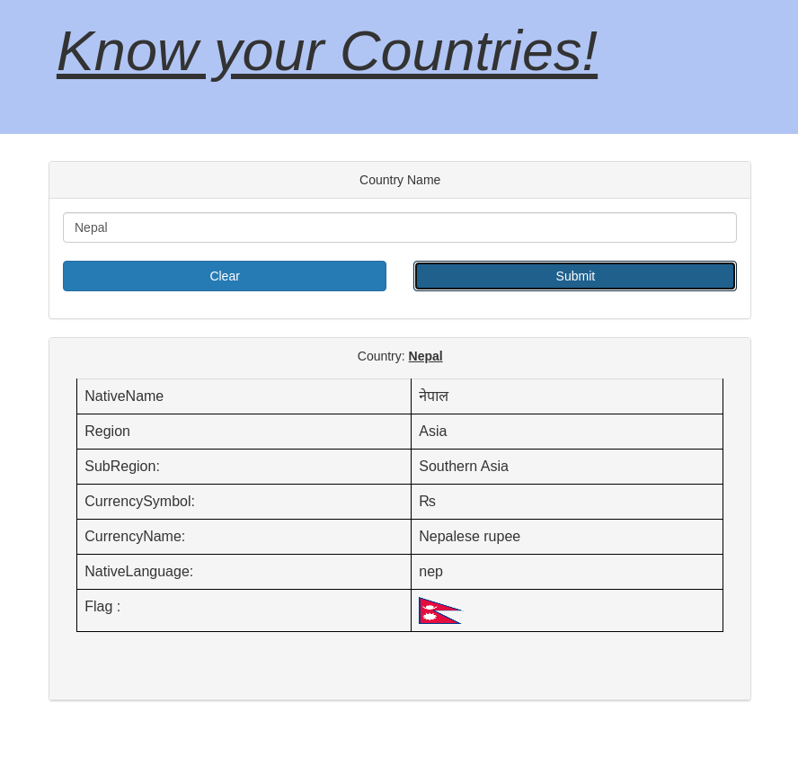

# Know Your Countries Demo Application For [Eclipse JKube](https://github.com/eclipse/jkube)

<p align="center">
  <a href="https://www.eclipse.org/jkube/">
    
  </a>
</p>


## Running the application in dev mode
This project uses Quarkus, the Supersonic Subatomic Java Framework.

If you want to learn more about Quarkus, please visit its website: https://quarkus.io/ .

You can run your application in dev mode that enables live coding using:
```
./mvnw quarkus:dev
```

You can access your application at localhost:8080 as usual. It brings up a basic form
to enter country name and displays basic information about the country provided:

<p align="center">
  <a href="https://www.eclipse.org/jkube/">
    
  </a>
</p>

## Packaging and running the application

The application is packageable using `./mvnw package`.
It produces the executable `todo-app-1.0.0-SNAPSHOT-runner.jar` file in `/target` directory.
Be aware that it’s not an _über-jar_ as the dependencies are copied into the `target/lib` directory.

The application is now runnable using `java -jar target/todo-app-1.0.0-SNAPSHOT-runner.jar`.

## Creating a native executable

You can create a native executable using: `./mvnw package -Pnative`.

Or you can use Docker to build the native executable using: `./mvnw package -Pnative -Dquarkus.native.container-build=true`.

You can then execute your binary: `./target/todo-app-1.0.0-SNAPSHOT-runner`

If you want to learn more about building native executables, please consult https://quarkus.io/guides/building-native-image-guide .

## Deploying to Kubernetes using Eclipse JKube

Add Eclipse JKube Kubernetes Maven Plugin as dependency:
```xml
<plugin>
  <groupId>org.eclipse.jkube</groupId>
  <artifactId>kubernetes-maven-plugin</artifactId>
  <version>1.0.1</version>
</plugin>  
```

Run these goals(Assuming you have access to a docker daemon and Kubernetes Cluster):
```
mvn package k8s:build k8s:resource k8s:deploy
```

## Deploying to Red Hat OpenShift using Eclipse JKube

Add Eclipse JKube Kubernetes Maven Plugin as dependency:
```xml
<plugin>
  <groupId>org.eclipse.jkube</groupId>
  <artifactId>openshift-maven-plugin</artifactId>
  <version>1.0.1</version>
</plugin>  
```

Run these goals(Assuming you have access to an OpenShift Cluster):
```
mvn package oc:build oc:resource oc:deploy
```
